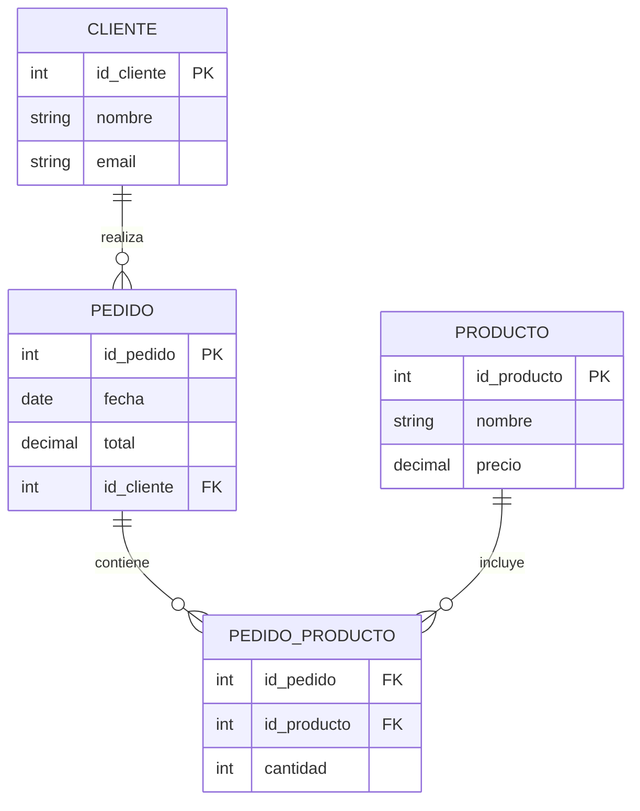

# Modulo 36. Documentar para el futuro

## 🧭 36.1. Por qué documentar importa de verdad

Cuando diseñas una base de datos, **tú sabes cómo funciona**:

- Qué tablas están relacionadas,
- Qué significan las columnas,
- Qué reglas existen detrás de cada restricción.

Pero dentro de seis meses:

- Otro desarrollador (o tú mismo) tendrá que entender todo sin preguntar.
- Y si no hay documentación… perderá horas, cometerá errores o rehará trabajo que ya estaba hecho.

📌 La documentación no es un “lujo corporativo”:

👉 es **parte de la arquitectura de datos**.

## 🧠 36.2. ERDs (Entity-Relationship Diagrams)

Los **diagramas entidad-relación** son la forma visual más clara de:

- Mostrar entidades (tablas),
- Mostrar relaciones entre ellas,
- Explicar cardinalidades y llaves,
- Servir como **mapa visual** para desarrolladores y analistas.

Ejemplo simple de un ERD:

```
Cliente (id_cliente PK, nombre, email)
Pedido (id_pedido PK, fecha, total, id_cliente FK)
Producto (id_producto PK, nombre, precio)
Pedido_Producto (id_pedido FK, id_producto FK, cantidad)

```

Relaciones:

- Cliente 1—N Pedido
- Pedido N—N Producto (a través de Pedido_Producto)

📌 Con un ERD, cualquier persona nueva puede entender la base sin abrir una sola línea de código SQL.

## 🧭 36.3. Herramientas prácticas para ERDs

Puedes usar desde herramientas sencillas hasta soluciones colaborativas profesionales:

- **dbdiagram.io** — ligera y gratuita, perfecta para documentación viva.
- **Draw.io / diagrams.net** — simple, rápida, exportable.
- **DBeaver / TablePlus / pgModeler** — generan ERDs automáticos desde bases reales.
- **PlantUML / Mermaid** — ideal si prefieres versionar diagramas junto al código.

Ejemplo Mermaid:



👉 Esto se puede versionar junto al repositorio.

## 🧠 36.4. Catálogos de datos — saber **qué significa cada campo**

Un **catálogo de datos** es básicamente un **diccionario que describe cada tabla y columna** de tu base.

Debe incluir:

- Nombre de tabla y columna,
- Tipo de dato,
- Descripción funcional (qué representa),
- Restricciones o valores permitidos,
- Origen y uso (si aplica).

Ejemplo:

| Tabla | Columna | Tipo | Descripción | Restricciones |
| --- | --- | --- | --- | --- |
| cliente | id_cliente | INT | Identificador único del cliente | PK, autoincrement |
| cliente | email | VARCHAR(255) | Correo electrónico del cliente | UNIQUE, NOT NULL |
| pedido | total | DECIMAL(10,2) | Total de la compra | >= 0 |
| pedido_producto | cantidad | INT | Cantidad del producto en el pedido | > 0 |

📌 Este documento es oro cuando:

- Alguien debe hacer integraciones externas.
- Un analista necesita entender los datos.
- Hay que migrar a otro motor o arquitectura.

👉 Lo ideal: **versionar este catálogo junto al código** y actualizarlo con cada cambio estructural.

## 🧭 36.5. Linaje de datos — saber **de dónde vienen y a dónde van**

El **linaje de datos** (data lineage) describe **el recorrido que hace la información**:

- Desde que se crea,
- A través de qué transformaciones pasa,
- Hasta dónde se usa.

Ejemplo:

```
Formulario web → Tabla clientes → Vista marketing → Dashboard BI

```

Para una columna específica:

```
email (clientes) → se anonimiza → tabla marketing_email → herramienta externa de newsletters

```

📌 Esto permite:

- Detectar impactos cuando cambias una estructura,
- Cumplir normativas (ej. GDPR),
- Mejorar trazabilidad.

👉 No necesitas una mega herramienta de “data governance” para empezar.

Un simple **mapa de flujo documentado** ya ayuda muchísimo.

## 🧠 36.6. Convenciones de nombres — pequeñas decisiones que ahorran grandes dolores

Tener **nombres consistentes**:

- Evita ambigüedades,
- Acelera el onboarding de nuevos desarrolladores,
- Hace más legibles las consultas SQL.

Buenas prácticas comunes:

- ✅ snake_case para tablas y columnas (`cliente_id`, `fecha_creacion`).
- ✅ nombres singulares para tablas de entidades (`cliente`, `pedido`).
- ✅ plural solo cuando tiene sentido lógico (`pedido_producto` para relaciones N-N).
- ✅ prefijos o sufijos claros si hay variantes (`vista_cliente`, `tmp_*`, `log_*`).
- ✅ FK con el mismo nombre que la PK referenciada (`cliente_id` en pedido).

❌ Evitar:

- Nombres genéricos tipo `data1`, `table2`, `valor`.
- Usar mayúsculas inconsistentes.
- Columnas con significados diferentes en tablas distintas.

📌 Convenciones consistentes = menos documentación que leer = menos errores.

## 🧭 36.7. Versionar la documentación junto al código

Un error común es tener documentación en PDFs olvidados o wikis desactualizadas.

👉 La documentación **debe vivir con el proyecto**:

- Dentro del repositorio,
- Versionada con Git,
- Actualizada con cada migración estructural.

Ejemplo de estructura:

```
/docs/
  ├─ erd/
  │   ├─ mermaid.md
  │   └─ export.png
  ├─ catalogo_datos.md
  ├─ linaje_datos.md
  └─ convenciones_nombres.md

```

📌 Así, si alguien revisa una migración en Git, puede ver la documentación correspondiente al estado de la base en ese momento.

## 🧠 36.8. Documentación viva vs muerta

**Documentación viva**:

- Se actualiza automáticamente o como parte del flujo de trabajo.
- Vive en el repo.
- Es confiable.

**Documentación muerta**:

- Está en carpetas compartidas que nadie abre.
- Se hizo una vez al principio y nunca más.
- Nadie la cree ni la consulta.

👉 Lo primero construye sistemas sostenibles.

👉 Lo segundo genera deuda técnica.

## 🧭 36.9. Buenas prácticas para documentar bases de datos

- Documenta ERDs desde el principio.
- Crea un catálogo de datos claro y mantenlo actualizado.
- Registra el linaje de datos clave (especialmente de información sensible).
- Define convenciones de nombres y aplícalas de forma consistente.
- Versiona todo junto con el código fuente.
- Automatiza generación de documentación cuando sea posible.
- No documentes “por obligación”, sino para que otros (y tú mismo en 6 meses) puedan entender la base rápidamente.

## 🚨 36.10. Errores comunes

- Pensar que “la base se explica sola” (spoiler: no lo hace).
- Nombrar tablas y columnas de forma inconsistente.
- No actualizar la documentación tras cambios de esquema.
- Mantener la doc en un lugar separado e inaccesible.
- Hacer ERDs demasiado técnicos sin contexto funcional.
- No registrar el linaje → caos cuando cambias algo y rompes media empresa.