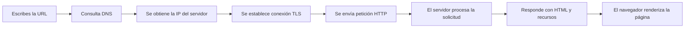

# Http, Https y ciclo de vida de una petición

## 🛰️ Módulo 3: HTTP y HTTPS – El lenguaje de la Web

### 🌐 ¿Qué es HTTP?

**HTTP** significa **HyperText Transfer Protocol** (Protocolo de Transferencia de Hipertexto).

Es el **protocolo que usan los navegadores para comunicarse con los servidores web** y pedirles información.

🔍 Ejemplo real:
Cuando escribes `https://wikipedia.org`, tu navegador le dice al servidor de Wikipedia:

> “Hola, soy un navegador. Quiero la página de inicio en HTML, ¿me la puedes enviar?”
> 

Y el servidor responde:

> “Claro, aquí tienes el HTML que necesitas.”
> 

### 🔒 ¿Y qué es HTTPS?

**HTTPS** es lo mismo que HTTP pero con **S de "Secure" (seguro)**.

Esto quiere decir que los datos viajan **cifrados** entre tu navegador y el servidor.

🔐 Esto evita que alguien pueda:

- Espiar lo que ves.
- Interceptar formularios o contraseñas.
- Suplantar la identidad del sitio web.

💡 **Ejemplo real:**

- HTTP: los datos viajan como una postal (todo visible).
- HTTPS: los datos viajan como una carta cerrada y sellada (nadie puede leerlos).

## 🔁 ¿Cómo funciona una petición HTTP?

Cada vez que visitas una web, haces una **petición HTTP**. Esta petición tiene:

1. **Una URL (dirección web)**
2. **Un método de petición** (como GET o POST)
3. **Cabeceras (headers)** con información
4. A veces, **un cuerpo (body)** con datos

Y el servidor responde con:

- Un **código de estado**
- Cabeceras propias
- A veces, un cuerpo con HTML, JSON, imágenes, etc.

## 📬 Métodos de petición HTTP

### 🧭 ¿Qué son?

Son **las acciones que el cliente (navegador, app, etc.) le pide al servidor**.

Los más comunes en desarrollo web son:

### 📥 `GET`

- Pide datos.
- Es lo que usa el navegador para cargar una página.
- No tiene cuerpo, solo cabeceras y URL.

🔍 Ejemplo:

```
GET /productos HTTP/1.1

```

### 📤 `POST`

- Envía datos al servidor.
- Se usa en formularios, autenticaciones, etc.
- Puede modificar la base de datos.

🔍 Ejemplo:

```
POST /login HTTP/1.1
Content-Type: application/json

{
  "usuario": "juan",
  "password": "1234"
}

```

### ✏️ `PUT`

- Reemplaza completamente un recurso existente.
- Se usa en APIs para editar elementos.

🔍 Ejemplo:
Actualizar el perfil de un usuario:

```
PUT /usuario/45 HTTP/1.1

```

### 🧩 `PATCH`

- Modifica **solo una parte** del recurso.
- Es más eficiente que `PUT`.

🔍 Ejemplo:
Cambiar solo el email del usuario:

```
PATCH /usuario/45 HTTP/1.1

```

### 🗑️ `DELETE`

- Elimina un recurso.

🔍 Ejemplo:

```
DELETE /comentario/99 HTTP/1.1

```

### 🧪 `OPTIONS`

- Pide información sobre lo que **se puede hacer** con un recurso.
- Se usa mucho con **CORS (Cross-Origin Resource Sharing)**.

### 👁️ `HEAD`

- Como `GET`, pero **solo pide las cabeceras**, no el contenido.

## 📊 Códigos de estado HTTP

Los códigos de estado te dicen **cómo fue la respuesta del servidor**.

Empiezan con un número que indica la categoría:

| Código | Categoría | Ejemplo real |
| --- | --- | --- |
| 1xx | Información | Poco usados, tipo "continuar" |
| 2xx | Todo bien | ✅ `200 OK`: La página fue cargada |
| 3xx | Redirección | 🔄 `301 Moved Permanently`: URL cambiada |
| 4xx | Error del cliente | 🚫 `404 Not Found`: Página no existe |
| 5xx | Error del servidor | 💥 `500 Internal Server Error`: algo falló |

🔍 Otros códigos útiles:

- `201 Created`: se creó algo (ej. una cuenta nueva).
- `204 No Content`: no hay contenido que devolver.
- `403 Forbidden`: tienes prohibido acceder.
- `429 Too Many Requests`: hiciste demasiadas peticiones.

## Otros protocolos de transferencia

## 📂 FTP y SFTP: ¿Cómo subimos archivos a nuestra web?

Cuando creas un sitio web en tu ordenador, en algún momento necesitas **subir esos archivos a Internet** para que los demás puedan verlo. Ahí es donde entran dos protocolos muy usados: **FTP** y **SFTP**.

## 🚛 ¿Qué es FTP?

**FTP** significa *File Transfer Protocol*, es decir, **protocolo de transferencia de archivos**.

👉 Sirve para **enviar o recibir archivos entre tu ordenador y el servidor web**.

### ✅ Ejemplo real:

- Usas un programa como **FileZilla** o el panel de tu hosting para **subir tu carpeta con `index.html`, imágenes, estilos, etc.** al servidor de tu web.
- Esto permite que tu sitio se publique y sea accesible desde `tudominio.com`.

💡 Es como **copiar y pegar archivos a una carpeta remota**, pero a través de Internet.

## 🔐 ¿Qué es SFTP?

**SFTP** es una versión más segura de FTP.

Significa *Secure File Transfer Protocol* (también conocido como *SSH File Transfer Protocol*).

🔒 Utiliza una conexión **cifrada a través de SSH**, lo que protege los archivos durante la transferencia.

### ✅ Ejemplo real:

- Si estás subiendo archivos importantes o accediendo a un servidor con datos confidenciales, SFTP asegura que **nadie pueda interceptar o modificar esos archivos**.
- Muchos proveedores de hosting solo permiten **SFTP por seguridad**.

## 🧠 ¿Cuándo usar FTP y cuándo usar SFTP?

| Protocolo | ¿Es seguro? | ¿Cuándo se usa? |
| --- | --- | --- |
| **FTP** | ❌ No (envía datos sin cifrar) | Sitios simples, entornos de prueba, redes internas |
| **SFTP** | ✅ Sí (usa cifrado SSH) | Publicación profesional, producción, hosting moderno |

## 💡 ¿Cómo se usan en la práctica?

1. Abres un programa como **FileZilla** o **WinSCP**
2. Escribes tus datos de acceso:
    - **Host**: `ftp.midominio.com` o `sftp.midominio.com`
    - **Usuario** y **contraseña**
    - **Puerto** (21 para FTP, 22 para SFTP)
3. Subes tu carpeta del sitio (ej: `miweb/`) al directorio del servidor (ej: `/public_html/`)
4. ¡Tu web ya está publicada!

## 🧩 Relación con el desarrollo web

| Función | ¿Qué permite? |
| --- | --- |
| Subir archivos HTML, CSS, JS | Publicar tu sitio web |
| Descargar copias de seguridad | Guardar tu web en local antes de actualizarla |
| Editar archivos directamente | Hacer cambios rápidos en producción (aunque no se recomienda) |

## ✅ Resumen final

- **FTP** y **SFTP** son **herramientas esenciales** para subir o modificar tu sitio web en un servidor.
- Hoy en día se recomienda **usar SFTP siempre que sea posible**, ya que **protege tus archivos con cifrado**.
- Es el equivalente a tener **una llave segura** para entrar y modificar el contenido de tu web en Internet.

## 📑 Headers (Cabeceras HTTP)

### 🧠 ¿Qué son?

Los **headers (cabeceras)** son líneas de información que van **al principio de cada petición o respuesta HTTP**.

Funcionan como un **conjunto de etiquetas** que dicen:

- Qué tipo de contenido se está enviando o esperando.
- Qué navegador hace la petición.
- Qué idiomas se aceptan.
- Si hay cookies o tokens de sesión.
- Qué servidor respondió, etc.

### 🔍 Ejemplo: Cabeceras de una petición HTTP

```
GET /index.html HTTP/1.1
Host: www.ejemplo.com
User-Agent: Mozilla/5.0 (Windows NT 10.0)
Accept: text/html
Accept-Language: es-ES

```

🔎 ¿Qué dicen?

- `Host`: dominio al que vas.
- `User-Agent`: navegador y sistema operativo.
- `Accept`: tipos de contenido que aceptas.
- `Accept-Language`: idioma preferido.

### 🔍 Ejemplo: Cabeceras de una respuesta HTTP

```
HTTP/1.1 200 OK
Content-Type: text/html
Content-Length: 342
Set-Cookie: sessionId=abc123
Cache-Control: no-cache
Server: Apache

```

🔎 ¿Qué dicen?

- `Content-Type`: tipo de archivo (`text/html`, `application/json`, `image/png`, etc.).
- `Set-Cookie`: asigna una cookie al navegador.
- `Cache-Control`: controla si se puede guardar en caché.
- `Server`: indica el software del servidor.

## 📦 Body (Cuerpo de la petición o respuesta)

El **body** es la parte **donde van los datos**.

Solo aparece en algunos métodos como `POST`, `PUT`, `PATCH` (nunca en `GET` o `HEAD`).

### 🧾 Ejemplo: Petición `POST` con body en JSON

```
POST /api/login HTTP/1.1
Content-Type: application/json

{
  "usuario": "maria",
  "password": "1234"
}

```

- Las cabeceras indican que se va a enviar JSON.
- El body contiene los datos (usuario y contraseña).

### 📤 En las respuestas:

El servidor también puede enviar un body con contenido: HTML, JSON, imágenes, etc.

## 🔐 TLS/SSL y el cifrado en HTTPS

### 🌐 ¿Qué es SSL/TLS?

- **SSL** = Secure Sockets Layer (obsoleto)
- **TLS** = Transport Layer Security (actual y seguro)

Ambos son **protocolos de cifrado** que hacen que **tu conexión sea privada y segura**.

### 🔍 ¿Qué hacen?

1. **Cifran la información** entre tu navegador y el servidor.
2. Evitan que alguien en el medio (como una red WiFi pública) lea tus datos.
3. Verifican que el servidor sea quien dice ser (certificados).

💡 Cuando ves el candado 🔒 en el navegador, significa que estás usando HTTPS con TLS.

## 🧪 ¿Cómo funciona el cifrado TLS (versión simple)?

1. **Tu navegador se conecta a un servidor HTTPS.**
2. El servidor envía su **certificado digital** (validado por una autoridad como Let's Encrypt).
3. El navegador verifica que el certificado es válido.
4. Ambos acuerdan una **clave secreta temporal** (esto se llama "handshake").
5. A partir de ahí, **toda la comunicación va cifrada** usando esa clave.

🔐 Aunque alguien intercepte los datos, no podrá leerlos sin la clave.

### 📜 ¿Qué contiene un certificado SSL?

- Nombre del dominio (ej: `www.tusitio.com`)
- Fecha de validez
- Entidad emisora (ej: Let's Encrypt, Sectigo, etc.)
- Clave pública del servidor

💡 Puedes ver los certificados de cualquier web clicando en el candado del navegador → “Ver certificado”.

## ✅ Resumen del Módulo 3

| Concepto | Qué aprendiste |
| --- | --- |
| HTTP/HTTPS | Protocolos que usa la web para comunicarse |
| Métodos HTTP | GET, POST, PUT, PATCH, DELETE, HEAD, OPTIONS |
| Códigos de estado | 200 OK, 404 Not Found, 500 Internal Error, etc. |
| Headers | Información adicional (tipo de contenido, navegador, cookies...) |
| Body | Datos que viajan en la petición o respuesta (JSON, HTML, etc.) |
| TLS/SSL | Sistema de cifrado que protege tu conexión |
| Certificados HTTPS | Identifican a los servidores y habilitan la seguridad web |

## 🌐 Módulo 4: El ciclo de vida de una petición HTTP

### 🔁 ¿Qué pasa desde que escribes una URL como `https://www.wikipedia.org`?

Vamos a verlo **paso a paso**, como si lo estuviéramos observando por dentro:

### 1. 🔍 **El navegador interpreta la URL**

- **Detecta el protocolo** (`https`)
- **Detecta el dominio** (`www.wikipedia.org`)
- **Asume que debe hacer una petición HTTP/HTTPS** al servidor de ese dominio

### 2. 🧭 **Consulta DNS: convierte el nombre en IP**

- El navegador no entiende nombres como `wikipedia.org`, necesita una **dirección IP**.
- Llama al sistema DNS para preguntar:
    
    > “¿Cuál es la IP de wikipedia.org?”
    > 
- El DNS responde con algo como `208.80.154.224`.

📌 Este paso puede usar caché local o DNS públicos como los de Google (`8.8.8.8`) o Cloudflare (`1.1.1.1`).

### 3. 🛰️ **Establecimiento de conexión**

- Si es HTTPS, se establece una **conexión segura (TLS/SSL)**:
    1. El servidor envía su **certificado digital**.
    2. Se negocia una clave privada.
    3. Toda la comunicación queda **cifrada**.

💡 A este proceso se le llama **handshake**.

### 4. 📬 **El navegador envía una solicitud HTTP (Request)**

Se hace una petición con cabeceras como esta:

```
GET / HTTP/1.1
Host: www.wikipedia.org
User-Agent: Mozilla/5.0
Accept: text/html
Accept-Language: es-ES

```

También puede incluir **cookies**, datos del usuario, tokens de sesión, etc.

### 5. 💻 **El servidor procesa la solicitud**

- El servidor analiza qué página pediste.
- Puede ejecutar código (PHP, Node.js, etc.), consultar una base de datos, o cargar archivos estáticos.
- Prepara la respuesta: código de estado + cabeceras + cuerpo.

### 6. 📤 **El servidor responde (Response)**

Ejemplo de respuesta:

```
HTTP/1.1 200 OK
Content-Type: text/html
Set-Cookie: sessionId=abc123

<!DOCTYPE html>
<html>
  <head><title>Wikipedia</title></head>
  <body>Contenido de la página</body>
</html>

```

### 7. 🧠 **El navegador interpreta el HTML**

- Crea el árbol **DOM** con el HTML.
- Descarga y procesa CSS, imágenes, JavaScript…
- Renderiza la página.

🔁 A veces se hacen **más peticiones HTTP** para cargar:

- imágenes,
- fuentes,
- archivos `.css`,
- archivos `.js`,
- peticiones AJAX o APIs.

## 🍪 Cookies, sesiones y autenticación

### 🍪 ¿Qué es una cookie?

Una **cookie** es un pequeño archivo de texto que el servidor guarda en el navegador del usuario.

📌 Se usa para:

- Recordar sesiones (usuario logueado)
- Preferencias (modo oscuro, idioma)
- Identificadores únicos

🔍 Ejemplo:

```
Set-Cookie: sessionId=abc123; Path=/; HttpOnly;

```

El navegador enviará esta cookie **en cada futura petición** al servidor.

### 🔐 ¿Qué es una sesión?

Una **sesión** representa el estado de un usuario mientras navega.

Está **almacenada en el servidor** y asociada a un **ID de sesión (cookie)**.

📌 Sirve para:

- Recordar que estás logueado.
- Guardar datos temporales como el carrito de compra.

🔍 Ejemplo:

```php
$_SESSION['usuario'] = 'juan';

```

### 👤 ¿Cómo funciona la autenticación?

Cuando haces login:

1. Envían tus credenciales (usuario + contraseña).
2. Si son correctas, el servidor crea una sesión o te da un **token**.
3. A partir de ahí, usas ese token o cookie para **acceder a rutas protegidas**.

📌 Métodos comunes:

- Cookies + sesiones (tradicional)
- JWT (JSON Web Token) en APIs modernas

## 📚 Resumen visual del ciclo de vida



## ✅ Conclusiones del Módulo 4

| Paso | Qué ocurre |
| --- | --- |
| DNS | Traduce el dominio en IP |
| Handshake TLS | Crea conexión segura y cifrada |
| Petición HTTP | El navegador pide la página |
| Respuesta HTTP | El servidor devuelve HTML y recursos |
| Renderizado | El navegador muestra la página al usuario |
| Cookies | Guardan información en el navegador |
| Sesiones | Guardan información en el servidor |
| Autenticación | Identifica al usuario y protege el acceso a áreas privadas |

---

[🧪 Actividad práctica explorando en ciclo de vida de una petición HTTP](%F0%9F%A7%AA%20Actividad%20pra%CC%81ctica%20explorando%20en%20ciclo%20de%20vida%20%201da9de518f22804387e4e5f0c77734c3.md)